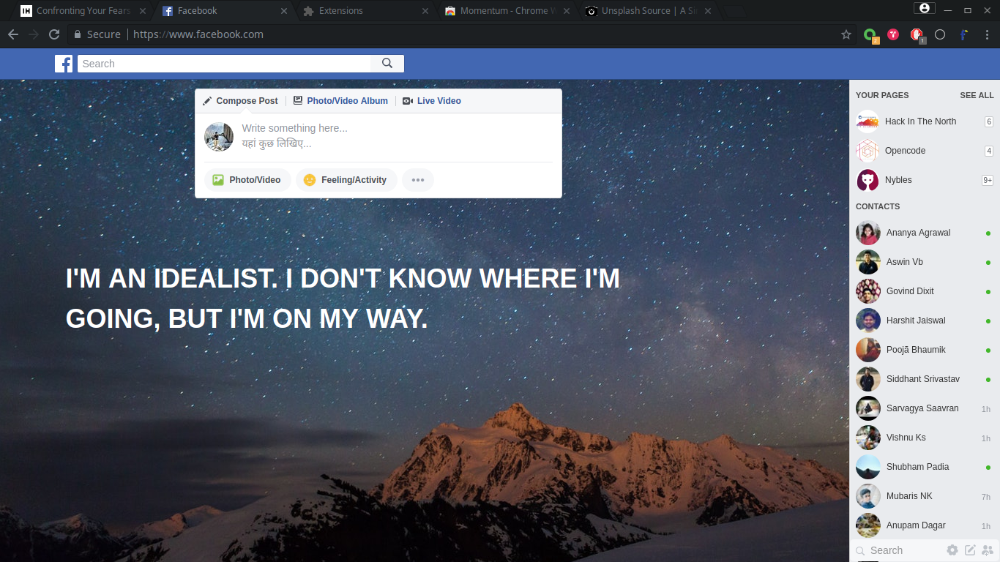
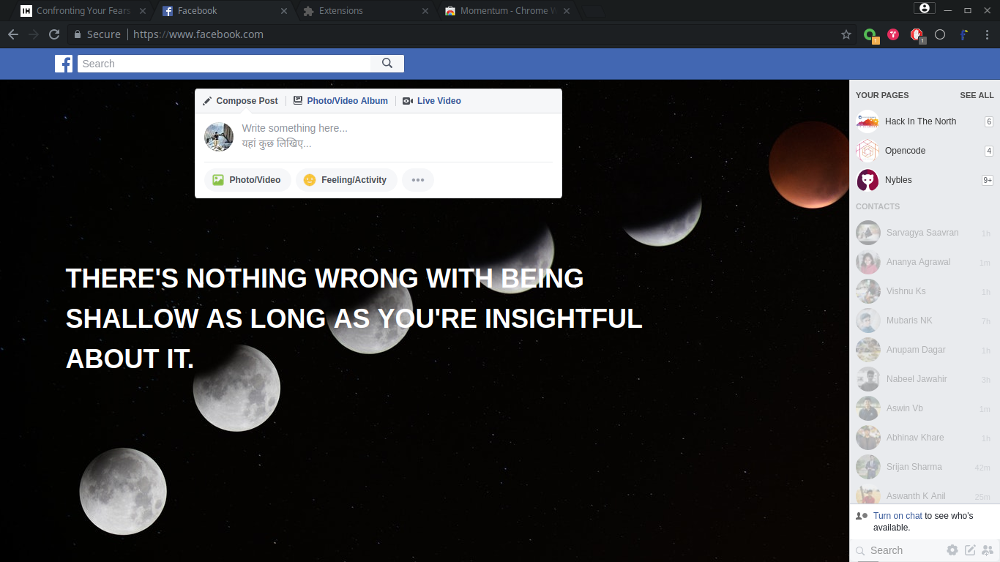
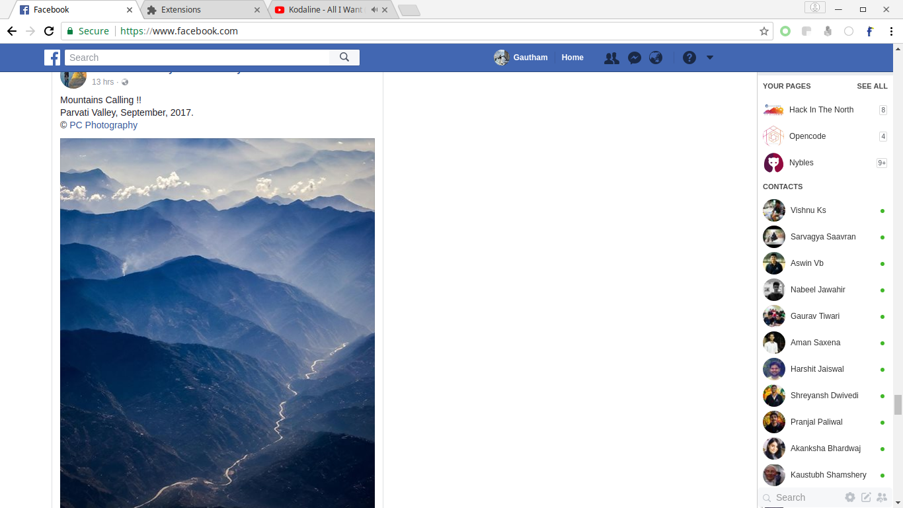

# Pelicon  

> Chrome extension for a better Facebook :rocket:

Pelicon is a chrome extension which makes Facebook more minimal and focused :shipit:.

**[Releases](https://github.com/aviary-apps/Pelicon/releases)** &nbsp;&nbsp;

 

## Highlights

- [Focus Mode](#focus-mode)
- [Minimal Mode](#minimal-mode)

## Features

### Focus mode

You can toggle in the popup to have a Focused version of Facebook.

- Removes Timeline
- Removes Notifications and Messages.

### Minimal Mode

You can toggle in the popup to have a minimal version of Facebook.

-  Only keeps timeline from main content.

## Customization

Clone the repository, make the adjustments you need, and [load the unpacked extension in Chrome](https://developer.chrome.com/extensions/getstarted#unpacked), rather than installing from the Chrome Store.

## Disclaimer

Pelicon is a third-party app and is not affiliated with Facebook.

## License

MIT